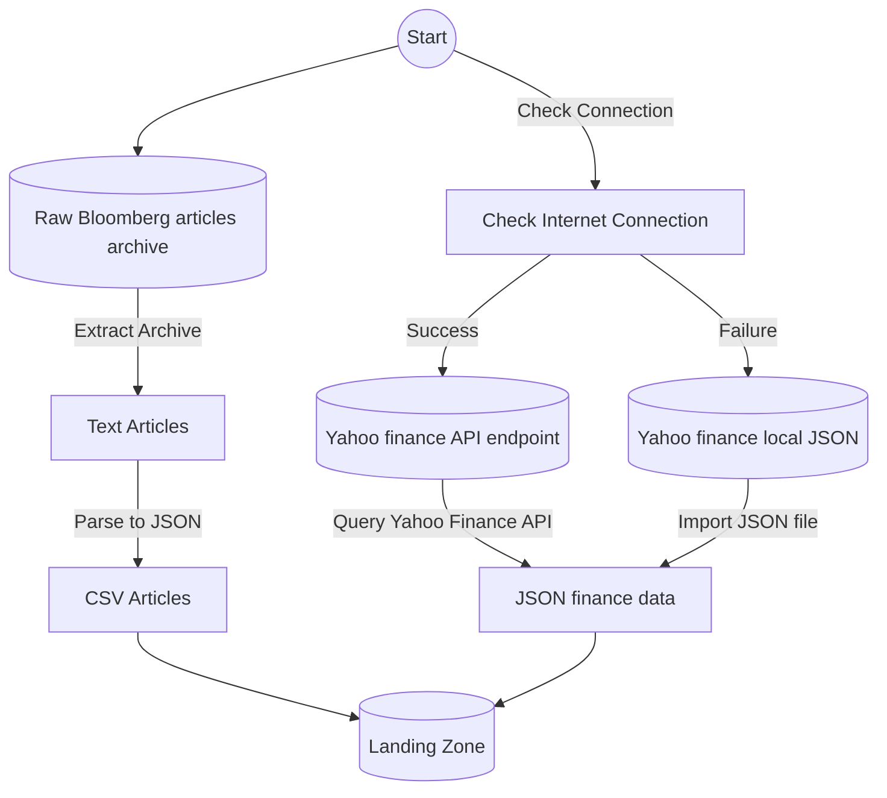
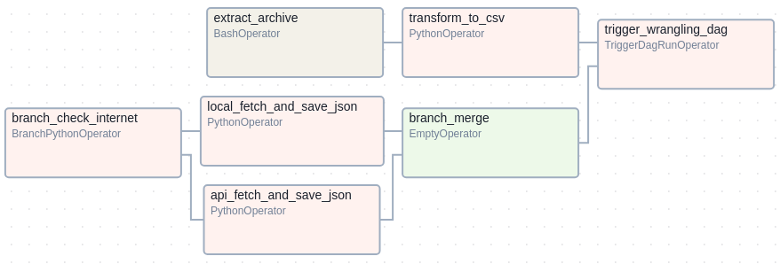
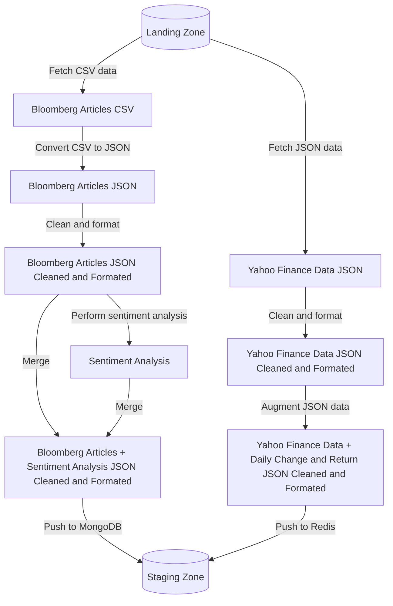
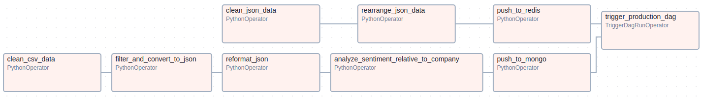
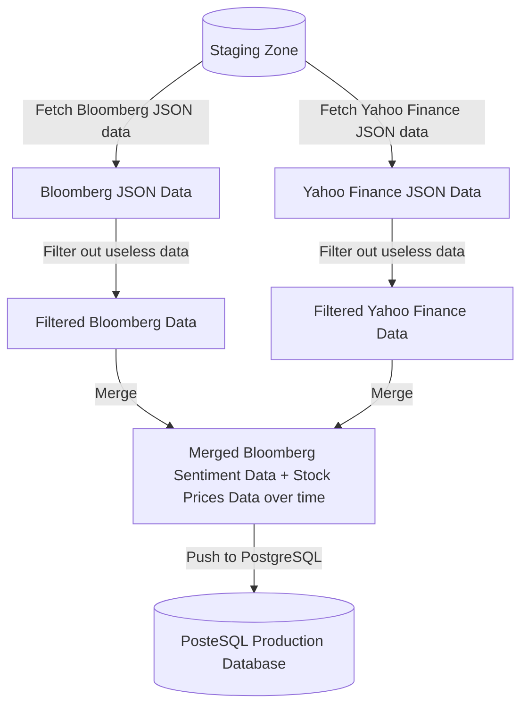
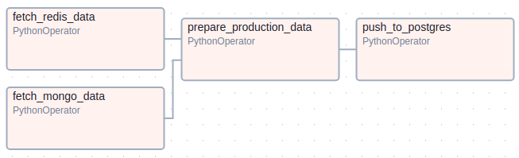
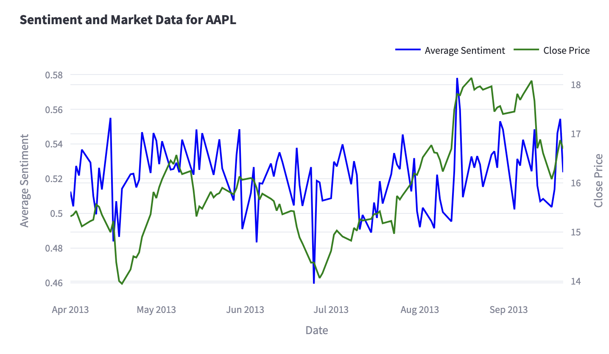
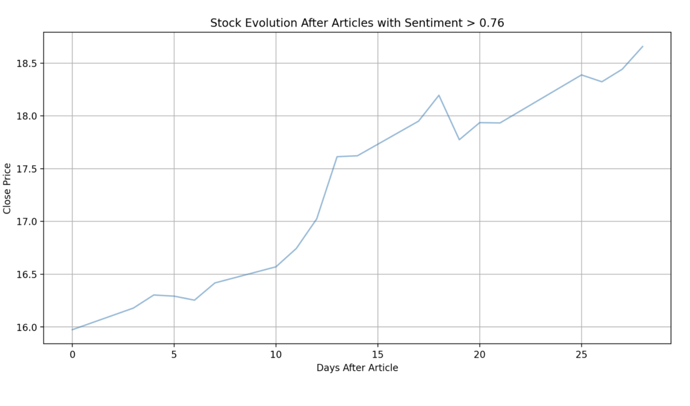

# Data Engineering Project 2024: Sentiment Analysis and Stock Market Correlation


Project [DATA Engineering](https://www.riccardotommasini.com/courses/dataeng-insa-ot/) is provided by [INSA Lyon](https://www.insa-lyon.fr/).

Students: Tom LAVIGNE, Joseph ROUQUETTE, Henry MONT

Teacher: Riccardo Tommasini

## Abstract
We aim to explore the relationship between sentiment expressed in financial news articles and stock market performance. By combining sentiment analysis of Bloomberg articles and financial market data from Yahoo Finance, we hope to uncover patterns that could provide insights into market behavior.

We would like to answer the following questions:  
1. Does the sentiment expressed in Bloomberg articles about a company correlate with its stock market performance over the same period?  
2. How did shifts in sentiment and market performance coincide with significant global events (e.g., the 2008 financial crisis or the iPhone launch), and could these patterns have provided early warnings of upcoming market changes?

## Datasets Description 
1. **Bloomberg Articles (2006–2013):**  
   - Format: Archived text files, organized in date-based folders.  
   - Access pattern: Batch loading of archives.  
   - Update frequency: Static data (not updated).  

2. **Yahoo Finance Market Data:**  
   - Format: API-delivered JSON data.  
   - Access pattern: API queries for stock prices, historical data, and market trends.  
   - Update frequency: Frequently updated.  

We chose two complementary data sources: Bloomberg articles and market data from the Yahoo Finance API. The articles are stored as text files in archives, requiring parsing, while the market data comes in JSON format via a live API. This mix of formats and access methods combines qualitative insights from the articles with quantitative metrics from the market data, making the analysis more well-rounded.

## Project steps

### Ingestion Phase

The first DAG is responsible for data collection.  

- **Bloomberg Articles:**  
  Articles are extracted from archived folders, parsed, and stored as CSV file (data plane) in a raw data zone for further processing.  

- **Yahoo Finance Market Data:**  
  Stock data is retrieved using the Yahoo Finance API. Historical data is downloaded and stored in the raw zone as JSON file (data plane).



**Ingestion DAG:**  
  

### Wrangling Phase

The second DAG cleanses, integrates and augment the data (droping columns, handling null values, handling incorrect dates, computing sentiment scores and stock prices shift, ...).  

- **Bloomberg Articles:**  
  The articles are cleaned, converted to JSON and Sentiment analysis is performed using NLP tools like `TextBlob` or `VADER`. The results are enriched with metadata (e.g., company mentions). Then the data is pushed onto MongoDB as JSON documents. This is the staging zone for Bloomberg Articles.  

- **Yahoo Finance Data:**  
  Market data is cleaned and aligned with article timestamps to facilitate correlation analysis. When the data is ready, it is pushed onto Redis using dates as keys for easy and efficient stock value retrieval. The Redis database is the staging zone for the Yahoo Finance Data.

- **Integration:**  
  As said before, both datasets end up in their respective staging zone and are now ready to be used for different use cases (for that purpose we'll refine the data in our production pipeline).  



**Wrangling DAG:**  
  

### Production Phase

The final DAG transforms the staged data into production ready data by filtering out useless columns and merging data together around date keys. We initially wanted to use InfluxDB to manage data as timeseries as this would have been the most straightforward but we had too much troubles installing InfluxDB on our airflow docker image so we ended up using PostgreSQL which is less efficient for our use case but it shouldn't pose a problem as we are not working with big data.  

On the vizualisation side, we simply had to pull the production ready data from PostgreSQL and then:  
- **Correlation plots:** Sentiment scores and stock data are ploted to look for correlations.  
- **Stock price behaviours on specific events:** Significant global events are identified and visualized to study their impact on sentiment and stock price.  



**Production DAG:**  
  

## Queries 
Once the data is stored in PostgreSQL and production ready, we access it using Streamlit for our datamart, the main query is as follow (really easy because the data as been tailored specifically for our use case through our production pipeline):
```SQL
SELECT date, avg_sentiment, close
FROM financial_sentiment
WHERE symbol = %s
ORDER BY date
```

## Results
1. Scattered correlation: Correlations can be observed between bloomberg articles sentiment score and stock prices on specific time intervals. However this does not seem to be a reliable way to predict stock prices.  
 

2. Strongly negative or positive sentiment: However we noticed that articles presenting extremely positive or negative sentiments often have preceded significant growth or losses in stock prices.  
 


## Requirements
* To have docker *and* docker-compose installed.
* Install docker and docker-compose exactly as it is described in the website.
* **do not do do apt install docker or docker-compose**

## Setting up the webserver

### Prepping

First, get your **id**:
```sh
id -u
```

Now edit the **.env** file and swap out 501 for your own.

Please clean up previous instances of docker containers, images and volumes for this project (the following commands remove everything, use with caution):
```sh
sudo docker stop $(sudo docker ps -aq)
sudo docker rm $(sudo docker ps -aq)
sudo docker rmi $(sudo docker images -q)
sudo docker compose down --volumes
sudo docker volume prune -f
```

Run the following command to delete files from previous executions (while in the StockMood folder):
```sh
sudo rm -rf config logs plugins data/*.csv data/*.json data/*.tar.gz data/20061020_20131126_bloomberg_news
```

And this **once** (if the exit code is 0 then it's all good):
```sh
docker compose up airflow-init
```

You can then run the whole docker:
```sh
docker compose up
```

## Running the pipelines

To run the pipelines, access airflow at:
```
http://localhost:8080/
```

Then trigger a manual run for the StockMood_Ingestion dag.

## Viewing

Once the pipelines have been run, you can visualize data using Streamlit at:
```
http://localhost:8501/
```  
You can also access the raw data using databases visualization interfaces at the following URLs:
- MongoDB:
```
http://localhost:8081/
```
- Redis:
```
http://localhost:5540/
```
