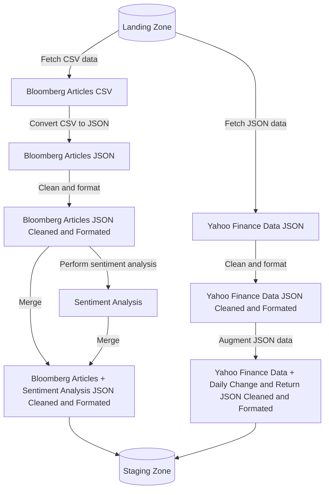
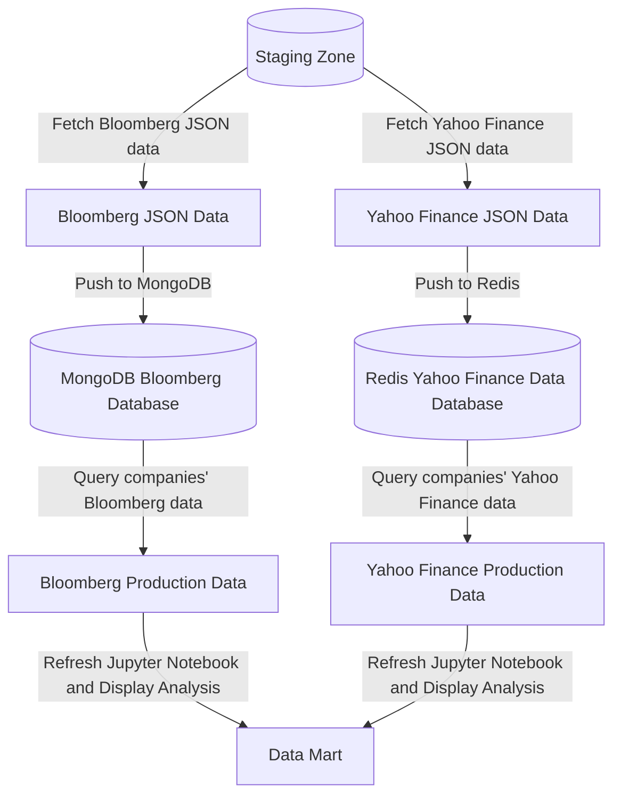

# Data Engineering Project 2024: Sentiment Analysis and Stock Market Correlation


Project [DATA Engineering](https://www.riccardotommasini.com/courses/dataeng-insa-ot/) is provided by [INSA Lyon](https://www.insa-lyon.fr/).

Students: Tom LAVIGNE, Joseph ROUQUETTE, Henry MONT

Teacher: Riccardo Tommasini

## Abstract
We aim to explore the relationship between sentiment expressed in financial news articles and stock market performance. By combining sentiment analysis of Bloomberg articles and financial market data from Yahoo Finance, we hope to uncover patterns that could provide insights into market behavior.

We would like to answer the following questions:  
1. Does the sentiment expressed in Bloomberg articles about a company correlate with its stock market performance over the same period?  
2. How did shifts in sentiment and market performance coincide with significant global events (e.g., the 2008 financial crisis or the iPhone launch), and could these patterns have provided early warnings of upcoming market changes?

## Datasets Description 
1. **Bloomberg Articles (2006–2013):**  
   - Format: Archived text files, organized in date-based folders.  
   - Access pattern: Batch loading of archives.  
   - Update frequency: Static data (not updated).  

2. **Yahoo Finance Market Data:**  
   - Format: API-delivered JSON data.  
   - Access pattern: API queries for stock prices, historical data, and market trends.  
   - Update frequency: Frequently updated.  

We chose two complementary data sources: Bloomberg articles and market data from the Yahoo Finance API. The articles are stored as text files in archives, requiring parsing, while the market data comes in JSON format via a live API. This mix of formats and access methods combines qualitative insights from the articles with quantitative metrics from the market data, making the analysis more well-rounded.

## Project steps

### Ingestion Phase

The first DAG is responsible for data collection.  

- **Bloomberg Articles:**  
  Articles are extracted from archived folders, parsed, and stored in a raw data zone for further processing.  

- **Yahoo Finance Market Data:**  
  Stock data is retrieved using the Yahoo Finance API. Historical data is downloaded and stored in the raw zone.  


### Wrangling Phase

The second DAG cleanses and integrates the data.  

- **Bloomberg Articles:**  
  Sentiment analysis is performed using NLP tools like `TextBlob` or `VADER`. The results are enriched with metadata (e.g., company mentions).  

- **Yahoo Finance Data:**  
  Market data is cleaned and aligned with article timestamps to facilitate correlation analysis.  

- **Integration:**  
  Both datasets are merged in a staging zone to prepare for production analysis.  



**Schema:**  
  

**Sample Data:**  
  

### Production Phase

The final DAG transforms the integrated data into actionable insights.  

- Sentiment scores and stock data are analyzed for correlations.  
- Significant global events are identified and visualized using temporal overlays.  

A Jupyter notebook or Streamlit dashboard is used to present:  
- Correlation heatmaps.  
- Timeline visualizations of sentiment and stock performance.  



**Example Output:**  
  

## Queries 

## Requirements
* To have docker *and* docker-compose installed.
* Install docker and docker-compose exactly as it is described in the website.
* **do not do do apt install docker or docker-compose**

## Setting up the webserver

### Prepping

First, get your **id**:
```sh
id -u
```

Now edit the **.env** file and swap out 501 for your own.

Run the following commands to clean up docker containers, images and volumes (use it with or without sudo depending on docker install):
```sh
sudo docker stop $(sudo docker ps -aq)
sudo docker rm $(sudo docker ps -aq)
sudo docker rmi $(sudo docker images -q)
sudo docker compose down --volumes
sudo docker volume prune -f
```

Run the following command to delete files from previous executions (while in the StockMood folder):
```sh
sudo rm -rf config logs plugins data/*.csv data/*.json data/*.tar.gz data/20061020_20131126_bloomberg_news
```

Run the following command to creat the volumes needed in order to send data to airflow:
```sh
mkdir -p ./dags ./logs ./plugins
```

And this **once** (if the exit code is 0 then it's all good):
```sh
docker compose up airflow-init
```

You can then run the whole docker:

```sh
docker compose up
```

## Running the pipelines

To run the pipelines, access airflow at:
```
http://localhost:8080/
```

Then trigger a manual run for the StockMood_Ingestion dag.

## Viewing

Once the pipelines have been run, you can visualize data using Streamlit at:
```
http://localhost:8501/
```